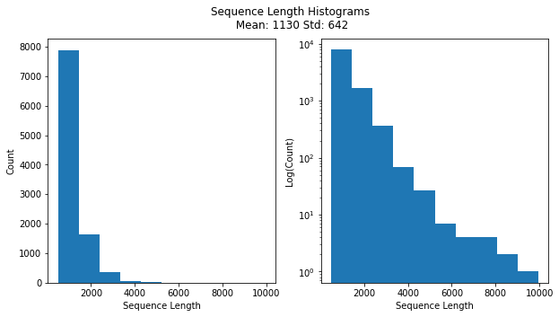
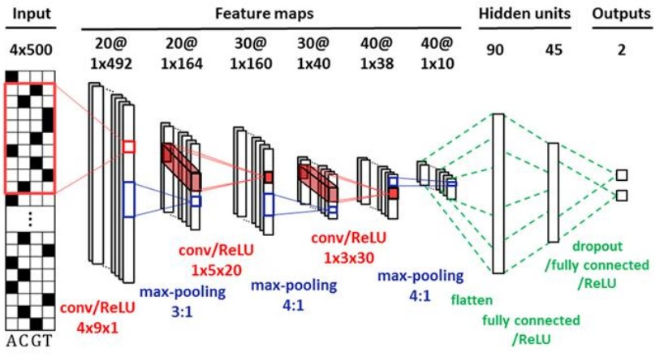
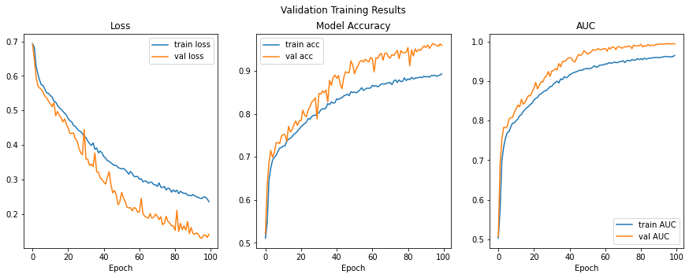

# DNA Classifiaction


This repo is a submission for the [8200Bio - BiomX data challenge](https://www.facebook.com/events/538411777487735). The challenge was binary classification of DNA sequences (bacteria/pahge). My solutions was a CNN implemented using TensorFlow.

my_utils.py contains all helper functions for dataset generation, preporcessing and visualisations.

encodeFASTA.py is a fork of [fasta_one_hot_encoder](https://github.com/LucaCappelletti94/fasta_one_hot_encoder) with my addition of zero padding to support DNA sequences of varying lengths.


## The Challenge
Given a balanced training set of 10k labeled sequences, classify DNA sequences of varying to either bacteria of phage (a virus that attackes bacteria).

Here's a sample entry from the train set:
```
>Phage-4995
ATGACGGCTGATCAGGTGTTTAACCAAGTGCTGCCTGAAGCTTACAAGCTT...
```


The main challenge was the varying length of sequences:




## The solution 
My solution was a CNN inspired by the following article [Enhancer Identification using Transfer and Adversarial Deep Learning of DNA Sequences](https://www.biorxiv.org/content/biorxiv/early/2018/02/14/264200.full.pdf):




**Why Use 1D Convolutions?**

The information we seek to learn from DNA sequences comes mostly in the form of specific protein sequences (k-mers, motifs, etc..). This means that a 1D covolution is more suited for our model than the "classic" 2D convolution which learns spatial features.

## Results
The trained network reached a validation accuracy of 96%.


 
It is important to note that validation set metrics seems to be much better than the train set metrics. This can ber explained by the relatively high dropout rate and by the small size of the validation set.

Results on the test set are TBD...


## License
[MIT Open Source](https://choosealicense.com/licenses/mit/)

Feel free to use this work as long as you refrence this repo.

Contact: doronser@gmail.com
